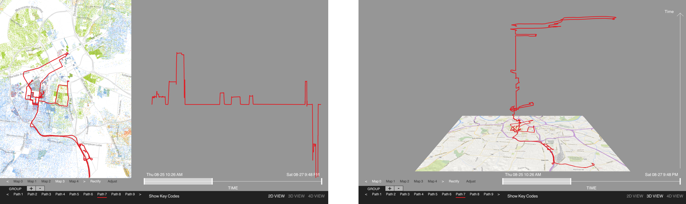

# IGS_Re-Shape
This software is a simplified version of the Interaction Geography Slicer (IGS) visualization tool that allows you to dynamically visualize your physical movement data over different thematic maps.

TO RUN THIS PROGRAM:

1) Please download the most recent version of Processing at: https://processing.org/download/

2) Place the folder titled "Unfolding" included in this repository within your processing "libraries" folder (located within the Processing folder on your computer). Unfolding is a wonderful mapping Library developed by Till Nagel & contributers (see credits below).

3) If you have not done so already, visit this link to understand how to collect, format, and load data into this program: https://www.maselfs.org/activity-4

4) Open and run any file in the IGS_ReShape folder in this repository in Processing.

CREDITS/LICENSE INFORMATION: This software is licensed under the GNU General Public License Version 2.0. See the GNU General Public License included with this software for more details. This program is distributed in the hope that it will be useful, but WITHOUT ANY WARRANTY; without even the implied warranty of MERCHANTABILITY or FITNESS FOR A PARTICULAR PURPOSE. See the GNU General Public License for more details.

This software makes use of the Unfolding Maps Library developed at the Interaction Design Lab, FH Potsdam, the HCI group, KU Leuven, and MIT Senseable City Labs. Copyright (C) 2015 Till Nagel, and contributors. See http://unfoldingmaps.org/contact.html 

IGS software was originally developed by Ben Rydal Shapiro at Vanderbilt University as part of his dissertation titled Interaction Geography & the Learning Sciences. Copyright (C) 2018 Ben Rydal Shapiro, and contributers. To reference or read more about this work please see: https://etd.library.vanderbilt.edu/available/etd-03212018-140140/unrestricted/Shapiro_Dissertation.pdf
